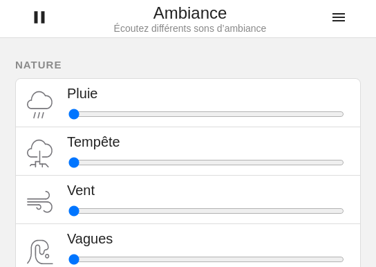

<h1 align="center">
  <a href="https://ambiance-sounds.netlify.app/">
	   
	  Ambiance
  </a>
</h1>

<strong>Listen to different sounds</strong>

Improve focus and increase your productivity by listening to different sounds. Or allows you to fall asleep in a noisy environment.

**[👉 Go to Ambiance website](https://ambiance-sounds.netlify.app/)**

  

## Credits

This is a web port of **[Blanket](https://apps.gnome.org/en/app/com.rafaelmardojai.Blanket/)**, a GNOME application by [@rafaelmardojai](https://github.com/rafaelmardojai/).

Sounds icons by Jakub Steiner.

Read the [sounds licenses](LICENSE-sounds.md).

## Contribute

This project was bootstrapped with [Create React App](https://github.com/facebook/create-react-app).

Get source code and depedencies :

    git clone https://github.com/yanbab/ambiance
    cd ambiance
    npm install

Start development server on http://localhost:3000 :

    npm start

Build production ready website in build/ :

    npm run build

Serve build site on http://localost:4000 :

    npm run serve